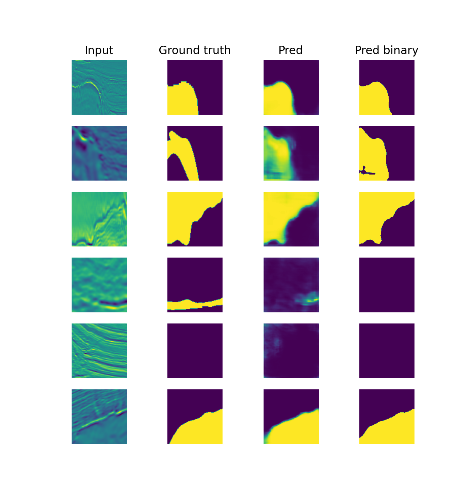

# Semantic segmentation
The goal of this lab is to train a [UNet model](https://arxiv.org/pdf/1505.04597.pdf) with an autoencoder structure to segment images obtained by seismic reflection and to detect the presence of salt or sediments in the sea bed.


## Downloading the data
The data was downloaded on https://www.kaggle.com/c/tgs-salt-identification-challenge/data?select=train.zip. It is composed of an `images` and `masks` folders, containing 4000 `.png` files of size 101x101 (that we resize at 128x128).

The data was then splitted in a train (80%) and test set (20%). 

## Getting started
To train the model :
```
python main.py --train
```

Once the UNet is trained, the file `model.pt` contains the trained model with the lowest loss obtained on the test set.


As the model was already trained (`batch_size = 32`, `num_epochs = 50`), you can infer a sample of test images with :

```
python main.py --infer
```

The files `train_loss.pkl` and `test_loss.pkl` allow you to plot the learning curves with
```
python main.py --curves
```

## Results
### Learning curves
We chose to keep the model (`model.pt`) with the lowest loss on the test set : here obtained at epoch 32, with `test_loss = 0.1784`.


### Inference of test samples
We chose a `threshold = 0.5` when binarizing the predictions :


